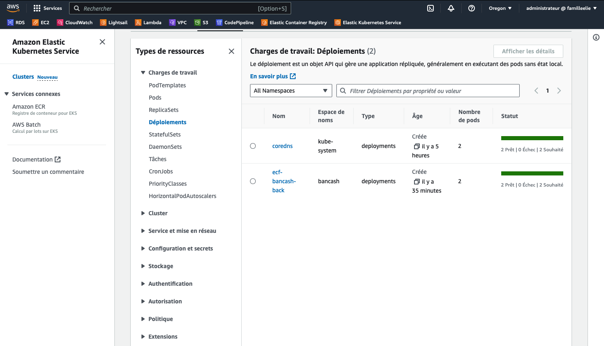
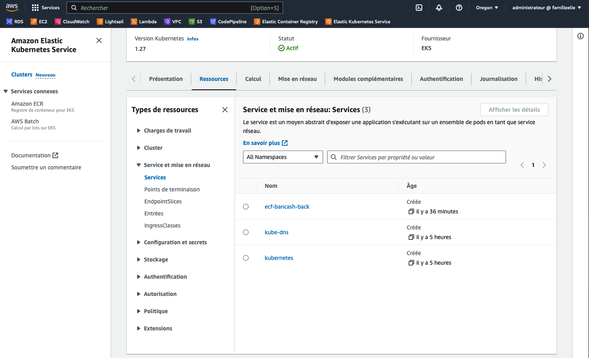
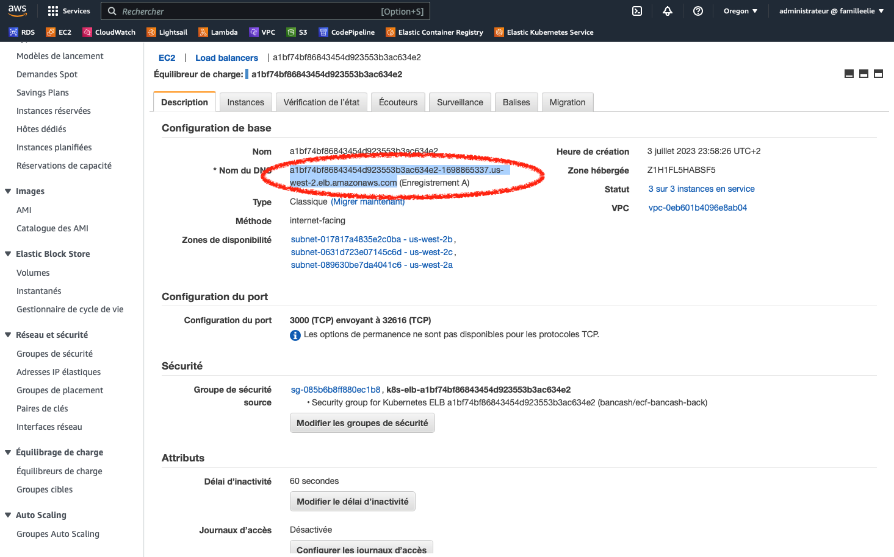
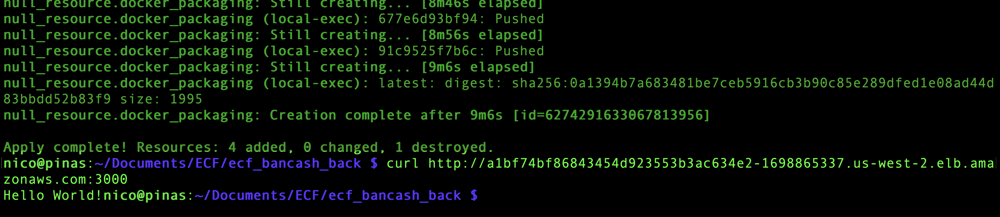
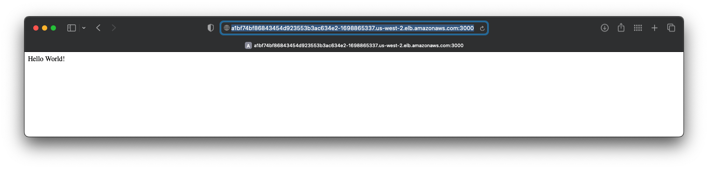
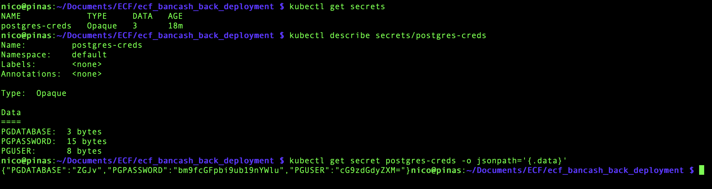
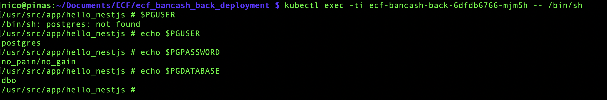

### Github repository : ecf_bancash_back_deployment.

# Activité Type 2 : Déploiement d’une application en continu

Included task :

3. É~~crivez le script qui build/test et le nodejs~~ et déployez le sur le kube créé

Included too :

## Activité Type 1 : Automatisation du déploiement d’infrastructure dans le Cloud

2. Ajoutez/configurez les variables d’environnement qui se connectent à la BDD 
   (added in the service definition on the Terraform script)

## Introduction :
<p>Works only when our AWS EKS Kubernetes cluster is up (see how : https://github.com/themaire/ecf_eks_terraform/) and the nodejs demo app is Dockerized (see how : https://github.com/themaire/ecf_bancash_back/), we can now deploy the app on the cluster.</p>

### What I done :

<p>
In the Terraform's main.tf I followed theses steps :

1. :
Create Kubernetes secret "by hand" following this official documentation link :<br>https://kubernetes.io/docs/tasks/configmap-secret/managing-secret-using-kubectl/<br>

Store localy for the ""<b>EXEMPLE</b>"" in the default namespace :

```
# Store Postresql credentials in local files (again, for the exemple) :
# * Data will be encoded in base64 by kubectl
mkdir ./secrets
echo -n 'dbo' > ./secrets/PGDATABASE.txt
echo -n 'no_pain/no_gain' > ./secrets/PGPASSWORD.txt
echo -n 'postgres' > ./secrets/PGUSER.txt
```

2. : Deploy our Docker image<br><br>
The kubernetes_deployment Terraform's ressource describes here several important informations lile the size of replicas in pods, witch Docker image is used, the container's application port and various container's environments variable (stored previosly in cluster's secrets) to provide a PostgreSQL database connexion as asked.<br><br>


4. : Declare a service<br><br>
Deployed application needs to be accessed outside the cluster from internet. The kubernetes_service Terraform's ressource describes the port number will the app be accessed from the internet.
VERY important : a load balancer is necessary to provide a url to the cluster.<br><br>


Make sûr to have terraform and aws cli command line tools installed and configured on your machine. Then, you can use the Terraform's main.tf file by :

Usage :
```
terraform init
terraform plan # For prevew what will do
terraform apply
```

# Screenshots
Just after "terraform apply" command is done, the deployment is well present and seen in the console. In the status, the two pods wanted are "ready".



As the deployment, service wanted too is also seen in the console.


<b>Public kuster's endpoint.</b> Load balancer for the cluster. Url marked in red for the access to the deployed app.


End of the Terraform's output. Deployment and service added with success.
Then, i tested the availability of the app with a simple curl command line.


NestJS demo application on a Kubernetes cluster deployed on the cloud is working! Well done! 😎


Look, my secrets havn't no secrets for you. 😙


Proof of evironment variables works with internal Kubernetes secrets manager.
To demonstrate, i was connected to a pod (on AWS!). You can see the three echo(s).


# Deployment complete!